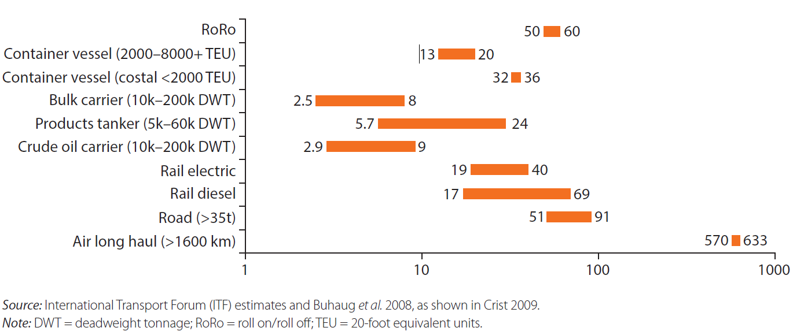
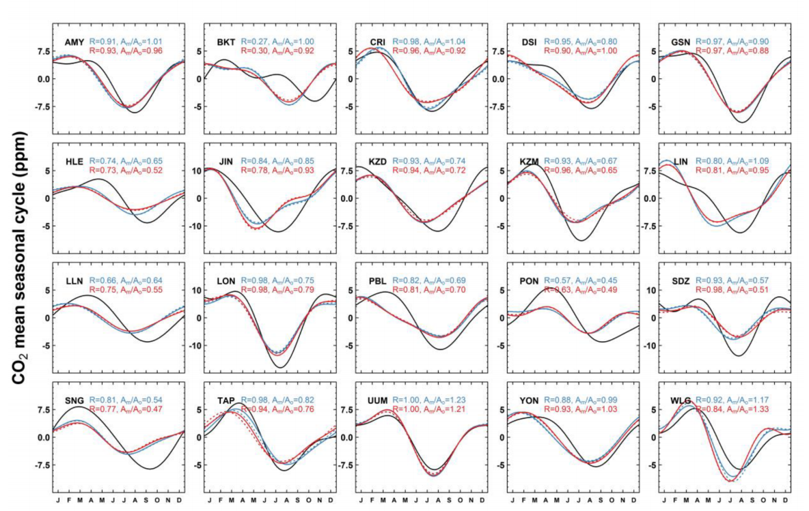

#### Using Greenhouse Gas Emissions Data to Estimate the Increase in Transportation Infrastructure in South East Asia
#### by Kyle Chen
Word Count: 2335  
  
  **Abstract**  

The high amount of economic and social development in Southeast Asia has also generated a large amount of greenhouse gases. The growth of greenhouse gas emission, as well as the distribution of the generation of greenhouse gases, can be used as a model to check the growth of internal and interregional infrastructure in Southeast Asian countries. The growth of infrastructure in the region post-economic reforms is an important insight as to understand internal mobility and migration movements, as well as to understand the efficacy of internal, interregional, and international trade.
  

This study is primarily focused on the use of greenhouse gas emissions data to estimate previous and future developments of internal infrastructure in Southeast Asia between 1980 and 2020, with greater focus on the mainland nations of the region such as Vietnam. The secondary focus of this study is to create a timeline of infrastructure growth in the region.

    
  **Introduction** 
    South East Asia was, during the age of colonialism, a primarily bicycle-riding society. The bicycle was, for all intents and purposes, the car of the region, and it transformed life such that semi-suburban neighborhoods sprung up on the outskirts of cities like Hanoi, and many subjects under the colonial authority sprung up to supplement the demand for this everyday commodity. In fact, by 1926, there were an estimated 50,000 Bicycles in the Cholon Quarter of Saigon (now Ho Chi Minh City), and in Hanoi, the bicycle was fast becoming a standard mode of transport. The economic importance of the bicycle was held in such high regard that, as can be seen with the development of mobile shops and bicycle-rickshaw taxis, the people of South East Asia tailored the mobility tool to their own needs, and local bicycle makers and mechanics were able to withstand the economic downturn of the Great Depression due to the high demand of bicycles for their added mobility (Arnold & DeWald, 2012).
    
By the end of the 1990s, motorbikes had overtaken the bicycle as the primary mode of popular transport in Mainland Southeast Asia. In 1996, there were 4 million motorbikes in Vietnam, and by 2016, there are 43 million, with 4 million alone in the capitol and about 470 motorbikes per 1000 people. After the Doi Moi, the shifting of Vietnam's economy from a Command Economy to a Market Socialist Economy, due to the relatively low initial costs of motorbikes, as well as savings due to how motorcycles not needing as much parking space/needing dedicated parking space, being taxed less than cars, and not requiring a driver's license. This, alongside Hanoi's narrow roads and underdeveloped public transportation system, have seen to the dominance of the motorbikes in the city. The car, on the other hand, has become a status symbol, a way to flaunt wealth and status (Hanson, 2017). In the island nations of Indonesia, Malaysia, and Singapore, however, longtime direct control by colonial powers meant that the automobile was already common in the streets after the end of European colonial rule.

   
The development of South East Asian transportation infrastructure, including rail- and waterway-based transport, as well as an increase in industry has led to an increase in CO2 emissions in the region. Thus, the spread of major population centers, as well as the development of smaller population groups, should show in the current data describing CO2 output, and predictions of future CO2 emissions should give us insight to how the population in these areas will spread. As transportation infrastructure must develop alongside population centers, CO2 emissions should be a good enough measure to check the growth of transporation infrastructure. As transportation infrastructure develops and populations increase, trade must increase to supply the demand, thus bettering the lives of people living in Southeast Asia and aiding in the human development of this region.
  
   
CO2 emissions, as well as nighttime light distributions, are also non-intrusive ways of obtaining development information. The lack of requiring to intrude on cellphone data transmissions allow for greater transparency with regards to future population distribution and infrastructure growth prediction.

   
This paper primarily discusses the development of Southeast Asian infrastructure, with Vietnam in particular, using greenhouse gas emissions over time as a model to represent the growth of both interregional and internal infrastructure, as well as a way to predict future growth of the sector by carbon dioxide emissions.
  
  
  **Human Development**  
  
In a study regarding the use of nighttime lights as a way to estimate carbon dioxide output, which primarily illustrates the differences between certain data sets and data visualization of those data sets on the Indochinese Peninsula regarding carbon dioxide output as a response for the "the strong need for a high resolution CO2 emission map for high-resolution atmospheric modeling and satellite CO2 analyses", the study evaluated nighttime lights (NTL) as a way to estimate carbon dioxide output compared to a population-based carbon dioxide emissions output model in unites of metric tons per year per 1x1 kilometer square of space (which will henceforth be referred to by "t/y/km^2"). Findings reveal that NTL and population-based models have extremely high variances, and at best should be used for broader analysis rather than minute CO2 analysis. The NTL estimations instead seem to have higher emission estimations towards areas with the highest population, namely inner city areas of Hanoi and Ho Chi Minh City, differing by more than 250 t/y/km^2 towards the NTL model when compared to the population driven model, and much lower emission estimations, differing by more than 250 t/y/km^2 towards the population-per-pixel model, in areas such as Can Tho City, which has approximately 1/8th of the population of Ho Chi Minh City (Gaughan et al., 2019).
  
  
In other Southeast Asian countries, as GDP per capita increases, energy use in kilograms of oil equivalent and CO2 emissions in metric tons per capita also increase. However, the rate at which energy is used and CO2 emissions increase decreases as the GDP per capita increases. For example, as Indonesian GDP per capita jumped from $780.092 in 2000 to $3113.481 in 2010, energy use per capita increased from 735.821 kilograms of oil to 874.581 kilograms, an increase of about 19%. This increase is much smaller than the increase in energy consumption per capita from 1990 and 2000, where GDP per capita increased from $585.001 to $780.092, and energy use increased from 543.705 kg to 874.581 kg, an increase of over 35% in energy usage. The paper concludes that, rather than increase CO2 emissions, financial development is an important driver for the reduction of the rate of CO2 emissions, and an "efficient financial sector has [a] dynamic role for reducing CO2 emissions." However, income growth, energy consumption, and open trade are still "main factors" in deteriorating the environment (Nosheen, Iqbal, & Hassan, 2019).
  
      
  **Trade Development**  
  
The shift in exports from China to exports from less developed countries such as Vietnam and Bangladesh have caused a surge in carbon dioxide emissions, while the growth rate of Chinese and Indian emissions have slowed between 2004-2011. Due to the amount of trade within the region doubling within this time period, some predict that this trend will "seriously undermine international efforts to reduce global emissions." By 2011, both China and India saw a increasing amount of carbon dioxide emissions going out of the country due to the export economies these two countries have. Conversely, Southeast Asia, Papua New Guinea, the Middle East, and South America saw an increase in carbon dioxide emissions going into the country due ot the import economies of these regions. Between 2004 and 2011, export trade from China to South America, Southeast Asia, and the Middle East increased by at least 100%. Chinese CO2 emissions with regards to export have in actuality increased from ~150 million tons (Mt) of CO2/year to ~250 Mt CO2/yr, and Other Asian and Pacific states (OAS) saw a comparitively small increase in emissions for in its import economies of 100%, from ~50 Mt CO2/yr to ~100 Mt CO2/yr (Meng et al. 2018).
  
  
Vietnamese GDP growth in particular, which averaged at a fairly sizable 7.2 percent per year between 1993 and 2013, can be attibuted to Vietnam's economic liberalization of the mid-1980s and their subsequent integration into the global economy. Despite Vietnam's preference on road-based infrastructure, which accounts for 40% of the national freight in tons per kilometer and is the recipient of about 80% of public transportation spending, road transport produces the most carbon dioxide of the transportation means. River barge transport is nearly 4 times as fuel efficent than the road-based freight trucking. With both major population and industrial sectors of Vietnam, Hanoi and HChi Minh City, being situated on the Red River and Mekong River Deltas respectively, water-based transportation of freight, inland waterway transport (IWT) freight accounts for 48.3% of the tons transported in-country, compared to road freight's 45.4% share of tons transported in-country. However, road-based freight transport has been growing much faster than that of IWT, and accounts for 6.2% more tons of freight per kilometer transported at 36.6%, compared to IWT's 30.2%, as the road-based transport on average transports freight 31 more kilometers than IWT at an average of 143 kilometers. The size of the Vietnamese river-going cargo vessels has increased from 33,859 vessels in 2000 to 95,126 vessels in 2010, of which 50% are smaller 5-15 ton vessels, with a growing number of larger vessels of the 300 ton and above classes. IWT freight transport is projected to increase from 200,000 tons per day in 2008 to 300,000 tons per day in 2030. and from Ho Chi Minh City and Hanoi Coastal shipping, according to data from the Vietnam Maritime Administration, also grew at an annual rate of 13.2% between 1998 and 2008. Overall tonnage that passed through Vietnam's seaports increased from around 40 million tons in 1995 to nearly 195 million in 2008, with ~42% of all tonnage being domestic freight transport and another 32% being export freight transport. These developments are especially important when taking into account emissions from each transportation type. With regards to the upper limits of the logarithmic scale detailing CO2 emissions in grams per ton-kilometer (g/ton-km), as shown in the figure below, road-based infrastructure is ~253% more CO2 intensive than vontainer vessels whose maximum carrying capacity is less than 2000 20-foot equivalent units (TEUs) and 455% more CO2 intensive than container ships of carrying capacities between 2000 TEUs and 8000 TEUs (Blancas & El-Hifnawi, 2014).
  
  
    
  
  
  **Prediction of Emissions**  
  
Newer emissions models, namely the one developed by the Laboratoire de Météorologie Dynamique, dubbed the "Interations between Chemistry and Aerosols", or "LMDz-INCA", using datasets from the World Data Center for Greenhouse Gases, still need to be calibrated properly for the detection and estimation of greenhouse gas emissions. Using this model to "predict" the previously observed data of both methane and carbon dioxide emissions from 2006-2013 in South and East Asia using two models: a standard version of the LMDz-INCA model and a zoomed version with a higher resolution centered over India and China. The study used data with a horizontal resolution of 50 km, as to "simulate the variations of CH4 and CO2 during the period 2006–2013." The model-projected data for South-East Asia, primarly Indonesia, and Southern East Asia, whose data collection centers are near Taiwan and Hong Kong, was very similar to that of observed data from the time period for methane emissions, which are primarily from anthropogenic sources, which are left unsaid by the study. However, the model was inconsistent with prediction of seasonal carbon dioxide emissions in parts per million, with a lower Pearson correlation value, with *R = 0.27* for the standard model and *R = 0.30* for the specialized model. This trend can also be seen for the other three data sets from the region. In both Northern-Southeast Asia and Southern Southeast-Asia, while the two prediction models are very similar, there exists a large standard deviation with regards to the observed data (Lin et al., 2018). Thus, while greenhouse gas emissions may be used for population distribution prediction related to transporation and industry, there exists too broad a set of data in the carbon dioxide prediction gradient in parts per million.
  
  
In particular, the BKT, PBL, DSI, and LLN graphs seen in Fig. 2, representing emissions data centers in Indonesia, Port Blair (India), Dongsha Island (South China Sea), and Taiwan, respectively, see significant variances between the observed and simulated mean monthly CO2 emissions (Lin et al., 2018).

    
  
  **Conclusion**  
  
The economic reforms of the 1980s and 1990s in Southeast Asian countries have caused a surge in population and GDP growth, and in-turn generation more CO2 emissions than before. In the region, the primary cause of this emissions spike is industry and infrastructure, with more CO2 emissions coming from open trade. Southeast Asian infrastructure, thus, had to develop in order to maintain the current system of internal and international trade. However, the current systems for prediction of greenhouse gas emissions has not been able to properly predict CO2 outputs with enough accuracy for use in population distribution prediction. Another issue is that current greenhouse gas detection systems do not have a small enough resolution to properly distribute CO2 and CH4 (methane) along an populated area. Thus, the previous growth of infrastructure and the prediction of infrastructure growth is difficult to obtain from just emissions data. However, with the abundance of internal waterways in the region, it is possible that greater emphasis on internal shipping may occur. However, the incredible growth of internal roadway infrastructure and the large amounts of funding that goes into roadways means that we may likely see greater greenhouse gas emissions away from waterways and further inland in the region.

  
The growth of Southeast Asian infrastructure can be seen primarily after the CO2 emissions spike and GDP growth during the 1990s, and rather into the 2010s, where both waterway and road-based trade have increased in volume in the mainland. By this point, Indonesia, Malaysia, and Singapore already have primarily waterway-based trade economies. However, the increase in GDP per capita within these countries likely saw to the increase in roadway infrastructure, due to the prevalence of the automobile in these areas.

  
#### References
Arnold, D., & DeWald, E. (2011). Cycles of Empowerment? The Bicycle and Everyday Technology in Colonial India and Vietnam. Comparative Studies in Society & History, 53(4), 971–996. https://doi.org/10.1017/S0010417511000478  

Blancas, L. C., & El-Hifnawi, M. B. (2014). Facilitating Trade through Competitive, Low-Carbon Transport: The Case for Vietnam’s Inland and Coastal Waterways. Directions in Development: Countries and Regions.  

Chontanawat, Jaruwan. (2019). Driving forces of energy-related CO2 emissions based on expanded IPAT decomposition analysis: Evidence from ASEAN and four selected countries. Energies (Basel), 12(4), 764.  

Gaughan, Andrea E, Oda, Tomohiro, Sorichetta, Alessandro, Stevens, Forrest R, Bondarenko, Maksym, Bun, Rostyslav, . . . Nghiem, Son V. (2019). Evaluating nighttime lights and population distribution as proxies for mapping anthropogenic CO2 emission in Vietnam, Cambodia and Laos. Environmental Research Communications, 1(9), Environmental Research Communications, 2019-09-11, Vol.1 (9).  
  
Hansen, A. (2017). Hanoi on wheels: emerging automobility in the land of the motorbike. Mobilities, 12(5), 628–645. https://doi.org/10.1080/17450101.2016.1156425

Lin, Xin, Ciais, Philippe, Bousquet, Philippe, Ramonet, Michel, Yin, Yi, Balkanski, Yves, . . . Zhou, Lingxi. (2018). Simulating CH 4 and CO 2 over South and East Asia using the zoomed chemistry transport model LMDz-INCA. Atmospheric Chemistry and Physics, 18(13), 9475-9497.  
  
Nosheen, Misbah, Iqbal, Javed, & Hassan, Syeda Anam. (2019). Economic growth, financial development, and trade in nexuses of CO2 emissions for Southeast Asia. Environmental Science and Pollution Research International, 26(36), 36274-36286.  
  
Meng, Jing, Mi, Zhifu, Guan, Dabo, Li, Jiashuo, Tao, Shu, Li, Yuan, . . . Davis, Steven J. (2018). The rise of South-South trade and its effect on global CO2 emissions. Nature Communications, 9(1), 1-7.  
