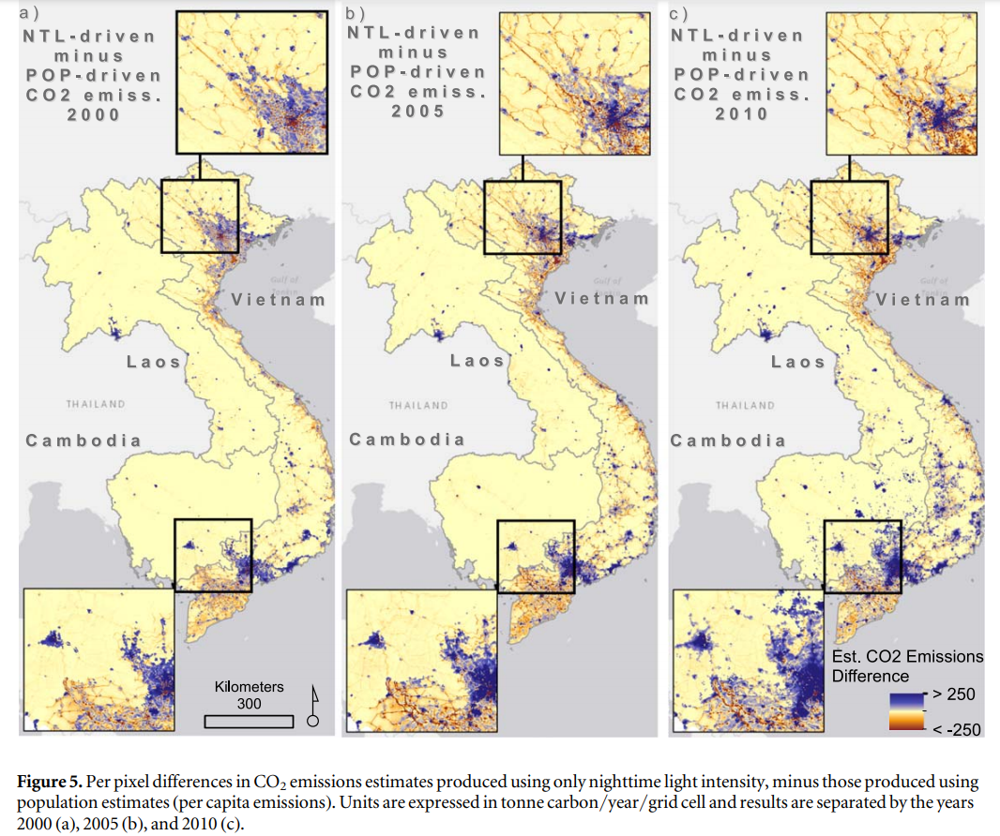
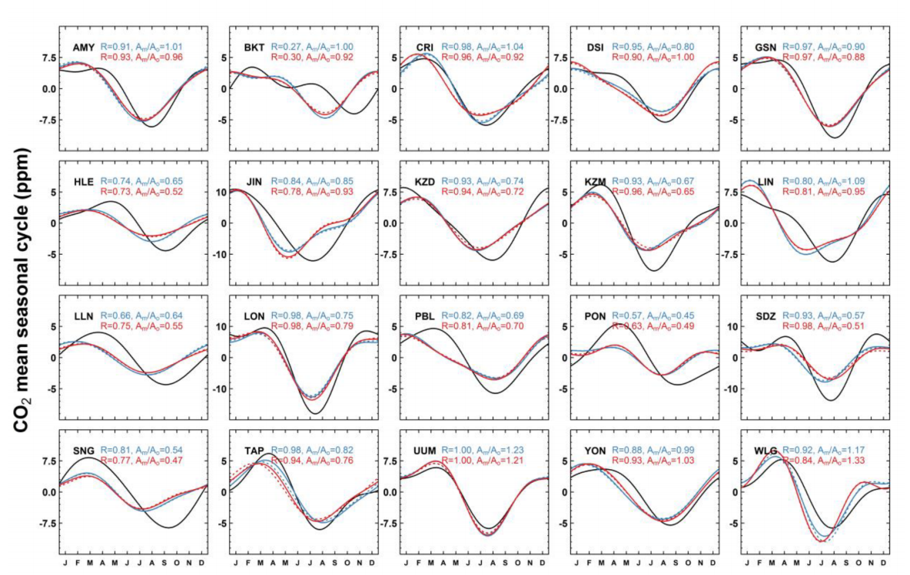
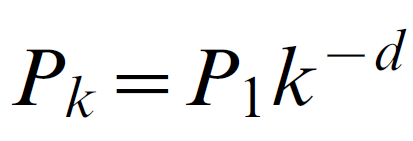
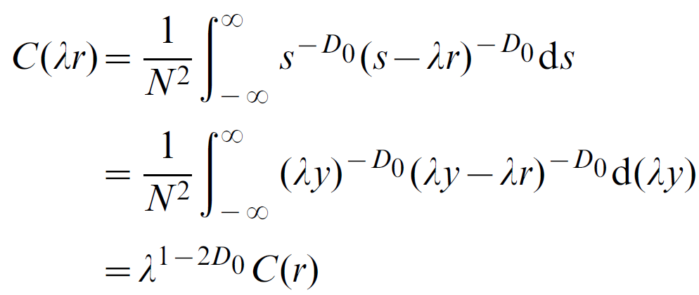
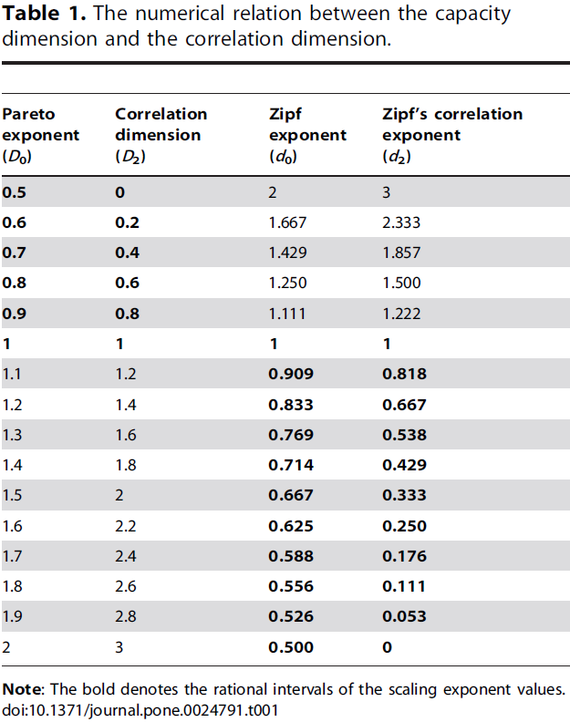

#### Methods for Predicting CO2 Emissions in Mainland Southeast Asia
#### by Kyle Chen
#### Word Count: 1523  
#### Due: April 25, 2021  
  
  
**Problem Statement**  
  
  Carbon Dioxide emissions are the primary human-generated cause of Climate Change and Global Warming. Climate Change, with the melting of the ice at both the North and South Poles, is endangering island and coastal communities, who may see their homes swept away into the sea. People have adapted by supporting renewable energy sources for local powergrids and homes, as well as adopting vehicles that use electricty in some way. By mapping carbon dioxide output over time in developing countries, we are able to develop methods to reduce the rate at which carbon dioxide emissions increases, and by adding a predictive element to the model, we are able to project future carbon dioxide emissions by 100x100 meter spaces.  
  
  Thus, how can we use CO2 detection and prediction algorithms to project future emissions from developing countries onto a map with a high enough resolution to understand how and where CO2 is currently being produced and where it will spread.
  
**Introduction**  
  
  The development of Southeast Asian transportation infrastructure, including rail- and waterway-based transport, as well as an increase in industry has led to an increase in CO2 emissions in the region. Thus, the spread of major population centers, as well as the development of smaller population groups, should show in the current data describing CO2 output, and predictions of future CO2 emissions should give us insight to how the population in these areas will spread. As transportation infrastructure must develop alongside population centers, CO2 emissions should be a good enough measure to check the growth of transporation infrastructure. As transportation infrastructure develops and populations increase, trade must increase to supply the demand, thus bettering the lives of people living in Southeast Asia and aiding in the human development of this region.  
  
  With the rate at which transportation infrastructure in the region is growing, Southeast Asia had some of the highest increases of CO2 emissions within the last 30 years of any developing region on Earth. As such, using Southeast Asia as an initial test for mapping and predicting CO2 emissiosn would be a step towards decreasing the rate of CO2 emissions from transportation and industry.
  
**Data**  
  
  In a study regarding the use of nighttime lights as a way to estimate carbon dioxide output, which primarily illustrates the differences between certain data sets and data visualization of those data sets on the Indochinese Peninsula regarding carbon dioxide output as a response for the "the strong need for a high resolution CO2 emission map for high-resolution atmospheric modeling and satellite CO2 analyses", the study evaluated nighttime lights (NTL) as a way to estimate carbon dioxide output compared to a population-based carbon dioxide emissions output model in unites of metric tons per year per 1x1 kilometer square of space (which will henceforth be referred to by "t/y/km^2").  
  Both the population-per-pixel (PPP) and nighttime lights model reveal an increase in population concentrations in the metropolitan areas of cities such as Hanoi, and very small developments in outlying neighborhoods.
  Findings reveal that NTL- and population-per-pixel-based models have extremely high variances, and at best should be used for broader analysis rather than minute CO2 analysis. The NTL estimations instead seem to have higher emission estimations towards areas with the highest population, namely inner city areas of Hanoi and Ho Chi Minh City, differing by more than 250 t/y/km^2 towards the NTL model when compared to the population driven model, and much lower emission estimations, differing by more than 250 t/y/km^2 towards the population-per-pixel model, in areas such as Can Tho City, which has approximately 1/8th of the population of Ho Chi Minh City (Gaughan et al., 2019).  
  

  Newer emissions models, namely the one developed by the Laboratoire de Météorologie Dynamique, dubbed the "Interations between Chemistry and Aerosols", or "LMDz-INCA", using datasets from the World Data Center for Greenhouse Gases, still need to be calibrated properly for the detection and estimation of greenhouse gas emissions. Using this model to "predict" the previously observed data of both methane and carbon dioxide emissions from 2006-2013 in South and East Asia using two models: a standard version of the LMDz-INCA model and a zoomed version with a higher resolution centered over India and China. The study used data with a horizontal resolution of 50 km, as to "simulate the variations of CH4 and CO2 during the period 2006–2013." The model-projected data for South-East Asia, primarly Indonesia, and Southern East Asia, whose data collection centers are near Taiwan and Hong Kong, was very similar to that of observed data from the time period for methane emissions, which are primarily from anthropogenic sources, which are left unsaid by the study. However, the model was inconsistent with prediction of seasonal carbon dioxide emissions in parts per million, with a lower Pearson correlation value, with *R = 0.27* for the standard model and *R = 0.30* for the specialized model. This trend can also be seen for the other three data sets from the region. In both Northern-Southeast Asia and Southern Southeast-Asia, while the two prediction models are very similar, there exists a large standard deviation with regards to the observed data (Lin et al., 2018). Thus, while greenhouse gas emissions may be used for population distribution prediction related to transporation and industry, there exists too broad a set of data in the carbon dioxide prediction gradient in parts per million.

  In particular, the BKT, PBL, DSI, and LLN graphs seen in Fig. 2, representing emissions data centers in Indonesia, Port Blair (India), Dongsha Island (South China Sea), and Taiwan, respectively, see significant variances between the observed and simulated mean monthly CO2 emissions (Lin et al., 2018).  
    
  
**Data Gaps**
  
  While the LMDz-INCA model was useful in the prediction of methane, the primary issue is that the prediction of CO2 emissions per regional station was found to be inconsistent at best. The low Pearson correlation value of the LMDz-INCA model for CO2 emission prediction of *R = 0.27*, leaves much room to improve with regards to prediction of emissions. The relatively low resolution of the models is likely one of the factors for this poor correlation value.  
    
  Given city growth rates, if we could somehow correlate the growth of CO2 emissions and industrial demand, as well as the increase in nighttime lights and neighborhood growth, to the growth of a city using Zipf's law and the Pareto principle, or 80/20 rule, we could actively generate predictions of emissions and emission distributions. The general form of Zipf's law contains *P_k*, the population of the *k*th city, *P_1* the population of the largest city, *-d*, the size-rank of the *k*th city, and *d*, the scaling exponent/Zipf dimension. As can be seen in Equation 2, Zipf's Law (Equation 1) is the end result when manipulating the continuous density-density Pareto correlation function *C*, where *N* is the number of the city, *λ* is the scaling constant, where *s = λy*, *r* is the scale factor of city size, and *D_0* is the base fractal dimension (Chen, 2011).  
    
  
  
  As mentioned above, there exists a gap between CO2 emissions distributions between the people-per-pixel (PPP) model and the nighttime lights (NTL) model, usually between 250 tons-per-year/square-kilometer towards the NTL model when it comes to areas of greater absolute population, and towards the PPP model when it comes to other less-populous cities, as can be seen in Figure 1.  
        
  Ultimately, the variances between the two models may be great enough that it would be best if both were used, as to provide likely maximum/minimum CO2 emissions on a local scale.  
    
  The recent growth of cities due to an influx of people from rural areas in developing countries also places emphasis on the relation between Zipf's law and the Pareto principle, the former relating to the growth of the size of a city and the latter relating to the increase in the number of cities. As can be seen in Table 3 from Chen, the Pareto principle, more specifically, its exponent, is the inverse of the exponent of Zipf's law.
    
    
  Thus, when we can obtain the relationship between city size and CO2 emissions, we could also use the continuous correlation function to project this relationship to the creating of other cities. This model, when used alongside the PPP and NTL CO2 distribution models, should allow us to predict CO2 emissions by population, and distribute the data along the lines of population and nighttime light clusters.  
  
**Conclusion**  
    
  The development of modern mainland Southeast Asian cities and the subsequent increase in CO2 emissions gives us an insight into the importance of monitoring the growth of cities in developing countries. Creating prediction models for the purpose of predicting CO2 output by these developing cities, however, either lacks the proper resolution, as seen in the LMDz-INCA model, or has a high enough variance with another CO2 distribution and mapping model that proper conclusions cannot be made without further testing. However, future developments should take note of the inverse-relationship between the Pareto principle and Zipf's law and should develop further the relationship between carbon dioxide output and city size to allow for estimation of CO2 output based on city population. This, coupled with the aforementioned CO2 distribution models, is enough as a basis for future CO2 distribution prediction modelling.
  
#### References  
Chen, Yanguang. (2011). Modeling fractal structure of city-size distributions using correlation functions. PloS One, 6(9), E24791.

Gaughan, Andrea E, Oda, Tomohiro, Sorichetta, Alessandro, Stevens, Forrest R, Bondarenko, Maksym, Bun, Rostyslav, . . . Nghiem, Son V. (2019). Evaluating nighttime lights and population distribution as proxies for mapping anthropogenic CO2 emission in Vietnam, Cambodia and Laos. Environmental Research Communications, 1(9), Environmental Research Communications, 2019-09-11, Vol.1 (9).  
  
Lin, Xin, Ciais, Philippe, Bousquet, Philippe, Ramonet, Michel, Yin, Yi, Balkanski, Yves, . . . Zhou, Lingxi. (2018). Simulating CH 4 and CO 2 over South and East Asia using the zoomed chemistry transport model LMDz-INCA. Atmospheric Chemistry and Physics, 18(13), 9475-9497.
